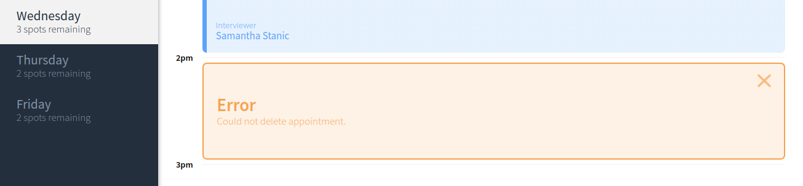

# Interview Scheduler Project

### Author

Berker Erol

### About

A dynamic single-page schedule project using React's latest version (i.e. 16.10.2) with Hooks. 
You can read about about Hooks [here](https://reactjs.org/docs/hooks-intro.html).

## The User Experience

Interview Scheduler lets a user (student) to book an interview with an interviewer by adding their name to scheduling component and easily selecting the interviewer. 

The user can edit or delete an existing interview as well as track the available spots remaining on the left-hand sidebar.

## Setup

1. Please install all dependencies with 'npm install'
2. You need to install scheduler-api (not in the same folder, but in a separate folder). You can find the scheduler-api [here](https://github.com/lighthouse-labs/scheduler-api)
3. Once you cloned scheduler-api to your local machine, you MUST follow the instructions on setting the database. Instructions are found on the scheduler-api's README file.
4. CD into scheduler-api directory on your host machine, and 
```sh
npm start
```
5. After you run your scheduler-api server, in another terminal, CD into this scheduler directory and finally run Webpack Development Server there by:
```sh
npm start
```
6. You can reset the database by visiting 
```
http://localhost:8001/api/debug/reset 
```

### Running Jest Test Framework

```sh
npm test
```

### Running Storybook Visual Testbed

```sh
npm run storybook
```

## Final Product

### Main Page

This is the main page--obviously the only page since this is a single React web application. It lists up to five appointments per day. There's a dynamic counter for the remaining spots.


### Creating A New Appointment

Allows the creation (or edition) of an appointment, by entering the name and selecting the interviewer.


### Deleting A New Appointment

Allows the deletion of an appointment, by confirming the action with the user.


### Error Handling

Displays error in case of an getting an HTTP request from the scheduler-API.



### Storybook Component Tests

Implemented [storybook](https://storybook.js.org/) to run component UI tests. 
This allowed to ensure interface identity and consistency throughout the development.


### Cypress End-To-End Tests

Implemented [cypress](https://www.cypress.io/) to create end to end tests.


### Jest Unit Tests

Built-in [jest](https://jestjs.io/) test coverage.


## Dependencies

- Axios
- Classnames
- Normalize.css
- React
- React Dom
- React Scripts
- Babel
- Babel Loader
- Storybook
- Jest
- Node Sass
- Prop-types
- React Test Renderer